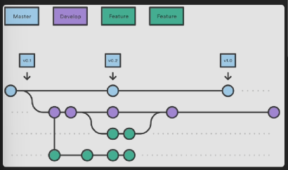
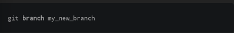
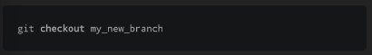
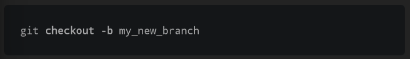

Branches atau percabangan adalah bagian paling penting pada git.

branch memungkinkan kita untuk membuat "salinan" dari project yang sedang di kerjakan dan melakukan perubahan tanpa mempengaruhi branch utama (main branch/master branch), memberikan sebuah kesempatan untuk bekerja bersama dalam suatu project dengan commit yang berbeda, ketika anda ingin menambahkan sebuah fitur atau memperbaiki bug, tidak peduli seberapa besar kecilnya perubahan tersebut - anda membuat branch baru untuk rangkuman perubahan anda

setelah perbaikan tersebut selesai, anda dapat menggabungkan perubahan terebut dengan branch master

membuat branch baru dapat menggunakan perintah

git branch my_new branch

dan ketika untuk berganti branch kita dapat menggunakan perintah checkout

git checkout my_new_branch

disini ada shorcut untuk membuat dan berghanti ke branch baru

git checkout -b my_new_branch

sekarang, setiap perubahan yang di buat pada branch baru disebut my_new_branch yang mana tidak akan berefek pada master branch
ini artinya anda dapat bekerja dengan aman pada project tanpa merusak sesuatu, setiap branch memiliki riwayat tersendiri, area staging dan area direktori pekerjaan

untuk melihat seluruh perubahan pada branch, jalankan perintah git branch pada diirektori project