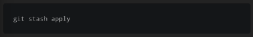

perintah stash digunakan untuk menyimpan sementara setiap perubahan yang anda buat pada salinan copy anda, sehingga anda bisa mengerjakan hal lainnya, dan kembali lagi untuk mengerjakannya kemudian.

perintah "git stash" mengambil yang tidak tercommit, baik yang staged ataupun tidak, dan menyimpannya untuk digunakan nanti

setelah stash dilakukan, anda dapat dengan bebas untuk melakukan perubahan, membuat commit baru, mengganti branches atau melakukan operasi git lainnya. dan kemudian anda dapat kembali dan meng-aplikasikan ulang stash anda

stash ini akan tetap pada repository lokal anda. dan tidak akan di transfer ke server saat anda melakukan push.

ada dua cara untuk mengaplikasikan stash yang ada :

git stash pop

pop akan menghapus perubahan stash dari state stash

git stash apply

apply mengaplikasikan perubahan stash yang sama pada beberapa branch

git stash tidak akan memasukkan file yang tidak di tracking secara default. untuk melakukan hal tersebut kita harus menambahkan opion -u (atau --include-untracked)