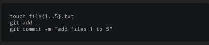
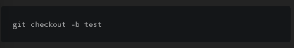
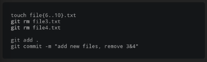
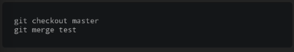

mari membuat dan commit beberapa file pada master branch (main branch), perintah touch dibawah akan membuat 5 buah file text dengan nama file 1.txt, file 2 txt, dst.

sekarang mari membuat dan mengganti ke branch baru

git checkout -b test

pada tahap ini, branch ini merupakan saliinan dari master branch, tetapi setiap modifikasi, penambahan dan pengurangan hanya pada bracnch terbaru saja, mari menambahkan beberapa file dan menghapus beberapa yang telah ada dan kembali melakukan commit perubahan

kita dapat menggunakan perintah rm, tetapi lebih bagus untuk menggunakan git rm, yang mana tidak hanya menghapus file sebenarnya, tetapi juga menghapus file tersebut dari disk dan juga stage perubahan akan di hapus.

sekarang kita memiliki 2 brach, master dan test (my_new_branch). kita pada my_new_branch memiliki beberapa file baru dan menghapus beberapa pada master branch, mari kembali pada master branch dan akhirnya gabungkan seluruh file tersebut

git checkout master
git merge test / git merge my_new_branch

git merge my_new_branch memberitahukan kepada Git untuk menggabungkan branch tersebut pada branch master.

pada tahap untuk menghapus branch yang tidak anda perlukan lagi, gunakan perintah
git branch -d my_new_branch