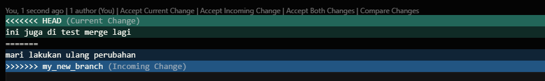

mari kita lihat jika kita mengganti file yang sama pada brach yang berbeda dan mencoba untuk menggabungkan branch tersebut.

buatlah file 1 dengan text originalnya pada branch mater
kemudian pada branch lainnya kita melakukan perubahan pada file 1 dengan menambahkan kata2 lainnya setelah kata-kata originalnya
kemudian commit perubahan anda dan kembali ke branch master

setelah kita tambahkan maka kita akan memiliki beberapa variasi pada branch yang berbeda (master dan my_new_branch), mari mergekan mereka dan lihat apa yang akan terjadi.

sedangkan pada branch in juga dilakukan perubahan
pastinya akan ada perubahan

ini juga di test merge lagi
mari lakukan ulang perubahan

selain dari aturan general yang mana branch yang akan muncul, tanda <<<<<<< anda akan melihat head dan my_new_branch setelah tanda >>>>>>>, yang mana versi dari sebuah branch

sekarang tergantung dari pilihan kita untuk tetap menggunakan branch awal, atau menggunakan brach my_new_branch, atau menggunakan perubahan baru yang menghubungkan kedua perubahan branch tersebut.
setelah itu kita akan menghapus conflict tersebut dan membuat perubahan final pada merge tersebut, simpan dan keluar dan commit perubahan anda.

jika anda melihat poerubahan commit anda (git log), anda akan melihat bahwa commit dari m,y_new_branch sekarang berada pada branch main dikarenakan merge tersebut.