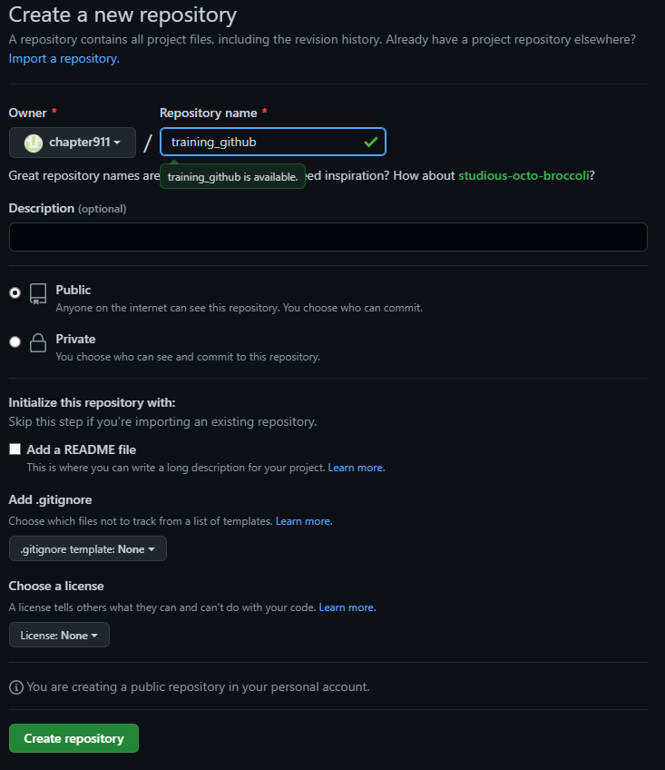
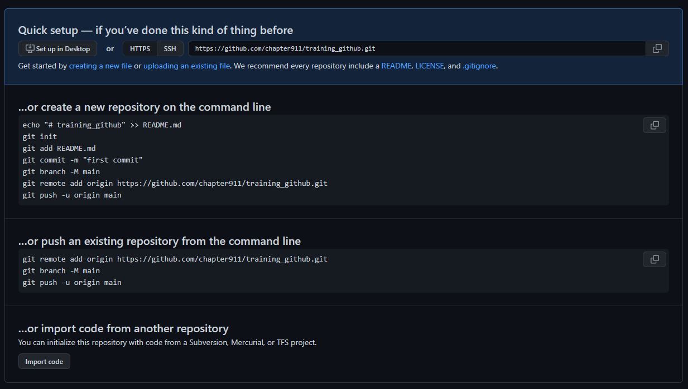

perlu diketahui perbedaan Git dan GitHub.

Git adalah Version Control System (VCS) untuk mengelola riwayat kode program anda.
Github adalah sebuah service hosting untuk repository Git anda

silahkan untuk membuat repository Github anda di github.com sebagai permulaan

setelah itu anda akan diarahkan secara otomatis ke sebuah halaman dimana anda akan melihat seluruh informasi step yang akan digunakan untuk melanjutkan ke langkah selanjutnya.

