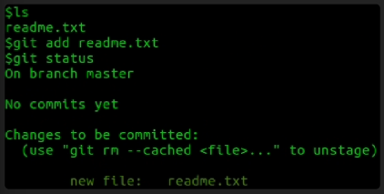

umumnya file dalam repository dapat memiliki beberapa status
1. not tracked
2. staged
3. commited

untuk mencari status sebuah file. diidalam repository, peritnah git status dapat kita gunakan
sebagai contoh kita memiliki file readme.txt pada repository kita,
menjalankan git status

seperti yang terlihat file readme.txt tidak di track/untracked
untracked disini artinya file tidak di track oleh git untuk perubahan, kita harus menjelaskan file mana saja yang harus di ikuti.
perintah git add 'file name' menunjukkan git untuk mengikuti file tersebut, tahap ini disebut stagging
mari kita tambahkan file readme.txt tersebut

jika anda tidak ingin git untuk mengikuti file spesifik, kamu dapat "ignore" file tersebut
dengan menggunakan .gitignore, setiap yang di listkan pada .gitignore akan diabaikan oleh git dan tidak akan terlihat pada repository.

mari membuat .gitignore juga, sebagai contoh file password.txt yang mana memiliki beberapa data sensitif yang kita tidak ingin terlihat secara publik pada repository tersebut

sekarang tulis text didalam password.txt tersebut, kemudian edit dari konten .gitignore menambahkan namafile password.txt agar bisa di abaikan

menjalankan git status menunjukkan hanya file di .gitignore yang tidak di ikuti, file yang berada di list tersebut berada di area stagging, dan tidkak berada pada repository kita. untuk menambahkan pada repository, kita perlu untuk "commit" file tersebut.

kita dapat menambahkan banyak file yang dibutuhkan ppada .gitignore dan menuliskan komentar (#comment) untuk mengingatkan alasan kenapa file tersebut diabaikan

