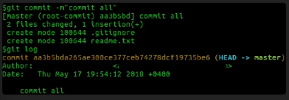

perintah git commit menyimpan state dari project anda dengan menambahkan snapshot pada staged file dalam repository

git commit dapat ditambahkan -m sebagai pesan yang mendeskrippsikan apa yang telah kita rubah

mengeksekusi git status setelah git commit untuk memverkifikasi bahwa file kita telah di perbaharui
hanya perubahan pada file staged (ditambahkan menggunakan perintah git add) yang akan ditambahkan pada repository dengan perintah git commit.
untuk melakukan modifikasi dari setiap file yang diikuti pada repository, gunakan perintah git commit -a

sayangnya,. pendekatan ini tidak dapat menspesifikasi kan komentar pada setiap file yang di commit
jika kita ingin melihat riwayat dari commit kita, gunakan perintah git log

perintah ini akan menampilkan list perubahan kita, termasuk tanggal, pelaku perubahan dan informasi yang dilakukan ketika setiap commit

setelah melakukan perubahan, langkah selanjutnya adalah melakukan "push" dari repository lokal ke server pada lokasi remote (seperti github)

terlalu banyak melakukan commit dapat menghasilkan banyak snapshot pada perubahan yang kecil, yang mana akan mempersulit informasi tujuan perubahan tersebut.

contoh terbaik untuk melakukan commit :
1. kita memperbaiki 2 bug pada file yang berbeda, kamu harus commit setiap perubahan secara terpisah karena dua hal tersebut tidak saling berhubungan

2. kamu memulai sebuah project dan mengerjakannya selama 1 minggu kedepan, kemudian kamu melakukan commit pertama. ini adalah contoh yang buruk, karena akan menghasilkan file yang besar dan kemungkinan banyak perubahan

3. kamu mencari dan memperbaiki beberapa kesalah penulisan, kamu harus commit semua file itu dengan pesan "fix typos"