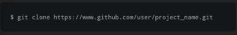
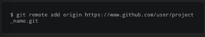
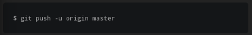

setelah commit perubahan, langkah selanjutnya adalah melakukan push dari repository lokal ke server (seperti github atau bitbucket).

setelah membuat sebuah repository remote, kita dapat memiliki beberapa opsi
1. mendownload / kloning repository dan lakukan perubahan
2. mengininsialisasi repository lokal dan menghubungkannya dengan remote
perintah clone digunakan untuk mendownload repository remote

cloning seharusnya dilakukan pada setiap awal dari sebuah project

jika kita telah menginisialisasi sebuah repositori lokal, kita dapat mengkoneksikannya ke repository remote dengan menggunakan perintah :

pushing remotely

setelah membuat perubahan lokal kita dan melakukan commit, saatnya melakukan push perubahan ke repository remote
perintah push memberitahukan Git kemana kita akan melakukan commit kita

nama dari repository remote kita dan default dari branch/lokal kita adalah master

perintah "-u" memberitahukan Git untuk mengingat parameter, jadi selanjutnya kita dapat dengan mudah melakukan push, sehingga git akan mengetahui apa yang akan dilakukan.
dan juga perlu di ingat bahwa ini tidak mesti untuk melakukan push project ke remote repository. anda bebas untuk bekerja pada project anda sendiri tanpa perlu melakukan push kemanapu, jika anda perlu seperti itu.