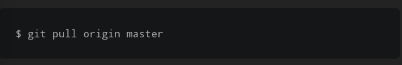
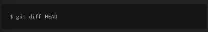

sebuah repository lokal mungkin memiliki commit yang di push oleh pengguna lain yang mengerjakan pada repository, untuk mendapatkan update terakhir pada project, terutama jika anda tidak mengerjakan project sendirian.

kita dapat melakukan pengecekkan pada repository github dan melakukan pull setiap perubahan baru.

kita dapat melihat apa saja perubahan yang berbeda pada commit terakhir kita dengan menggunakan perintah git diff

kita menginginkan mencari perbedaan dari commit terbaru, yang mana kita dapat mereferensikan dengan menggunakan pointer HEAD.