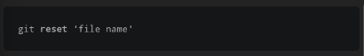
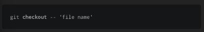

Anda dapat menggunakan diff untuk melihat perubahan pada file yang telah di stagged
menjalankan git diff --staged akan menunjukkan apa saja perubahan yang telah di stagged

sebuah stage juga dapat di reset menggunakan perintah reset

ini akan menghapus file dari status staged, yang berarti setiap perubahan hanya akan ada di file

untuk mereset file ke versi commit terakhir perintah checkout dapat kita gunakan

ini merupakan latihan yang bagus untuk menjalankan git diff dan melakukan reset terhadap file yang tidak sengaja terganti